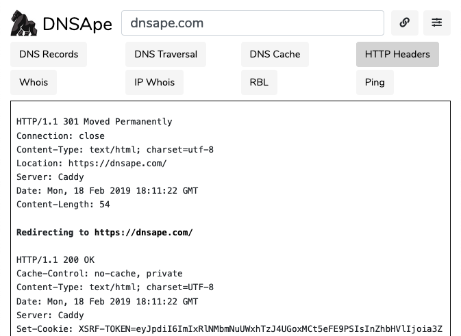

# DNSApe
> Fast Network Tools

DNSApe is a collection of network tools designed to be fast and efficient.



## Installation

Docker Swarm:

```sh
git clone https://github.com/srvaudit/dnsape-docker.git
cd dnsape-docker
docker stack deploy -c docker-compose.yml dnsape
```

DNSApe should also be deployable via Docker Compose, though this has not been tested.

You can manually install DNSApe on your own PHP application server.  An [Nginx configuration](https://github.com/srvaudit/dnsape-web/blob/master/dnsape.com.conf) is available. 

## Usage example

Usage is self evident, but, here it is anyway...

1. Need network debugging information
2. Visit DNSApe
3. Type or paste in the domain or IP being diagnosed
4. Click on a tool!

## Development setup

If you'd like to modify DNSApe, you can rebuild application assets when changing them. See the [Laravel docs](https://laravel.com/docs/5.7) for more information.

For developement and testing:

```sh
php artisan key:generate
composer install
npm install --unsafe-perm=true
npm run dev
```

For production:

```sh
composer install --optimize-autoloader --no-dev
artisan config:cache
artisan route:cache
npm run production
```

## Release History

See [UPDATES.md](https://github.com/srvaudit/DNSApe/blob/master/UPDATES.md).

## Meta

Distributed under the MIT license. See [``LICENSE``](https://github.com/srvaudit/DNSApe/blob/master/LICENSE) for more information.

[https://github.com/codercotton](https://github.com/codercotton/)

## Contributing

1. Fork it (<https://github.com/srvaudit/DNSApe/fork>)
2. Create your feature branch (`git checkout -b feature/fooBar`)
3. Commit your changes (`git commit -am 'Add some fooBar'`)
4. Push to the branch (`git push origin feature/fooBar`)
5. Create a new Pull Request
